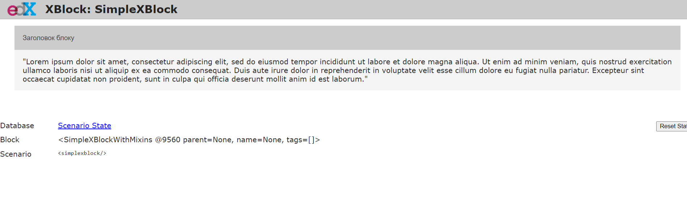

# Simple X-Block

This is the 
creation of the  XBlock module for the Open edX platform, which will display HTML content in the form of a collapsible block.

You can enter `pip install -r requirements.txt` in cmd/shell to make sure you have installed all the requirements.

###  Install XBlock SDK

You need to install and set up the XBlock Software Development Kit. For installation, you could check the official tutorial https://edx.readthedocs.io/projects/xblock-tutorial/en/latest/getting_started/setup_sdk.html 

### Install Simplexblock it in the XBlock SDK 

Clone the repository in your directory with XBlock SDK installed.
```shell
$ git clone https://github.com/pavlo-kapitanets/customxblock.git
```

Install simplexblock it in the XBlock SDK
```shell
$ pip install -e simplexblock
```

Create the SQLite database
```shell
$ python xblock-sdk/manage.py migrate
```

Run the XBlock SDK Server
```shell
$ python xblock-sdk/manage.py runserver
```

### SimpleXblock screenshot

